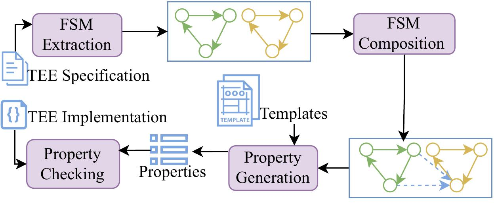
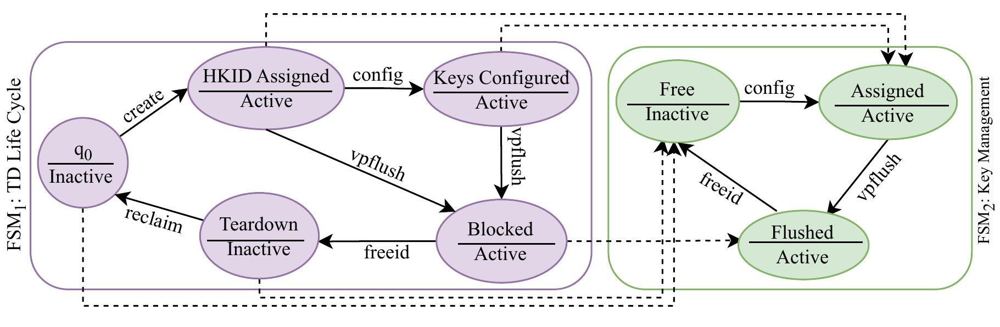

# TEE-Properties

TEE-Properties offers a tool for generation of verification properties for Trusted Execution Environments (TEEs). Our method facilitates the verification of TEE implementations by generating specific properties based on TEE specifications. This tool was developed at the [Embedded Systems Lab, Department of Computer Science, University of Florida](https://www.cise.ufl.edu/research/cad) as part of a project sponsored by [SRC](https://www.src.org/).

## Overview

Our approach provides a structured method to generate verification properties for TEE implementations. The process begins with extracting local Finite State Machines (FSMs) that describe security protocols based on TEE specifications. Next, a global FSM is composed by integrating the external relations identified among the local FSMs. Using this global FSM and predefined property templates, the tool generates verification properties. Finally, these properties are used to check the implementation of TEEs. This tool focuses on the third step of our framework, generating properties for verification.



## Templates for Different Types of Properties

| Property    | Template                   | Explanation                                                                         |
|-------------|----------------------------|-------------------------------------------------------------------------------------|
| Safety      | `G (q1 -> X (! (q2 U i1)))` | Ensures that from state `q1`, input `i1` does not lead to state `q2`.               |
| Liveness    | `G ((q1 & i1) -> F q2)`    | Guarantees that in state `q1` with input `i1`, state `q2` will eventually be reached. |
| Concurrency | `G ((q1 & q2 & ... & qn) -> o1)` | Verifies that concurrent execution of states `q1, q2, ..., qn` results in output `o1`. |

## Setup

To use the tool, execute the following commands:

```bash
./property_generation <fsm_file>
# Example
./property_generation fsm.json
```

## Environment Requirements

- **Python**: The tool is developed and tested with Python. Ensure Python is installed and configured on your system.
- **Operating System**: Designed to run on Ubuntu/Linux. Compatibility with other OSes is not guaranteed.

## Input

The tool requires an FSM (Finite State Machine) file as input, structured similarly to the global FSM format illustrated in `fsm.json`. Ensure your FSM file adheres to this format for accurate property generation.

### Sample Global FSM in `fsm.json` File



## Output

The tool generates a set of verification properties focusing on Safety, Liveness, and Concurrency aspects of TEE implementations. These properties are compiled and saved in a file named `property.txt`.

### Example of Output File

- **File**: `property.txt`
- **Contents**: Verification properties generated by the tool. Each property addresses a specific aspect (Safety, Liveness, Concurrency) relevant to the TEE implementation being analyzed.
